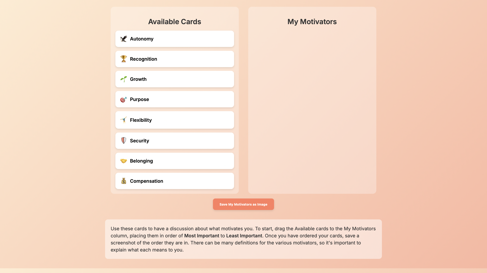

# Motivators

A colorful, drag-and-drop tool to rank your motivators for performance reviews, coaching sessions, and career planning.  

---

## 🚀 Features

- **Two Trello-style columns**:
  - **Available Cards** — randomized at page load.
  - **My Motivators** — where you arrange your top motivators.
- **Drag-and-drop**:
  - Move cards between columns.
  - Reorder cards in the **My Motivators** column.
  - Placement indicator shows where the card will land.
- **Icons for each motivator** for quick visual recognition.
- **Vibrant, modern design** using professional fonts and a playful color scheme.
- **Save your final order** as an image with one click.

---

## 💡 How to Use

1. Download or copy the `index.html` file from this repository.  
2. Open it in your preferred web browser.  
3. Drag cards from **Available Cards** to **My Motivators**, arranging them from *Most Important* (top) to *Least Important* (bottom).  
4. Click **Save My Motivators as Image** to download your ranked motivators.  

---

## 📄 Motivators List

- 🦅 **Autonomy**  
- 🏆 **Recognition**  
- 🌱 **Growth**  
- 🎯 **Purpose**  
- 🤸‍♂️ **Flexibility**  
- 🛡️ **Security**  
- 🤝 **Belonging**  
- 💰 **Compensation**

---

## 📦 Dependencies

- [html2canvas](https://html2canvas.hertzen.com/) — for saving column snapshots as images.

---

## 📜 License

MIT License — free for personal or commercial use.  
